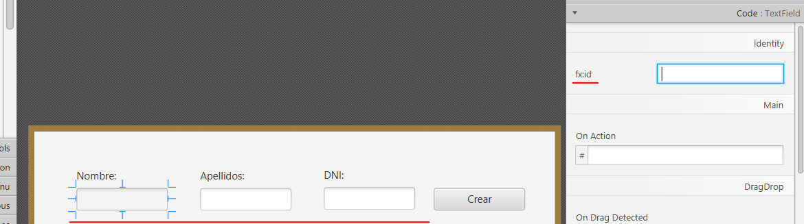
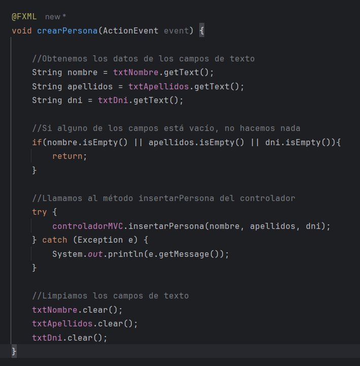
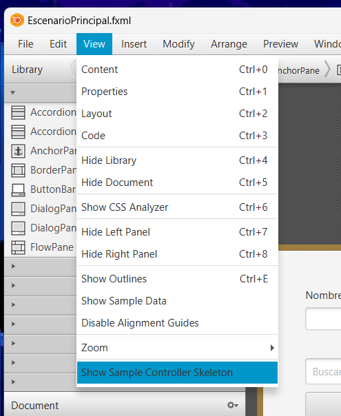
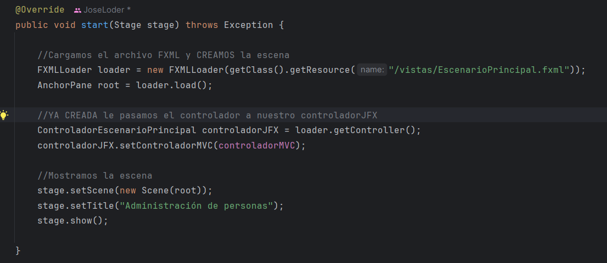

# CRUDJavaFX
 Proyecto de la clase `Introducción a JavaFX`.

## Descarga e instalación del proyecto

1. Nos ubicamos en la carpeta donde queramos instalarlo.
   

2. Clic derecho sobre la carpeta hasta que nos aparezca "Abrir en terminal".   
   Nos aseguramos de que la ruta de la terminal sea la misma que la de la carpeta
   

3. Lanzamos el comando `git --version`. (Si lo tenemos instalado pasamos al punto 5)

4. Instalamos git en el caso de que no nos haya reconocido el comando.  
   https://git-scm.com/download/win Comprobamos que esté instalado con `git --version`.
  

5. Lanzamos el comando que descargará el proyecto por la terminal que habíamos abierto anteriormente en la carpeta.  
   `git clone https://github.com/MartinSilvaJose/CRUDJavaFX.git`
  

   

## Configuración inicial

1. Nos descargamos el SDK de JavaFX.  
   Os lo facilito en este Link https://drive.google.com/file/d/1wVZT3pe-Ajp58jJgLPoLKXTy810iMxr1/view?usp=sharing  
2. Una vez descargado lo descomprimimos en la carpeta donde hemos clonado el proyecto.

3. A continuación, nos dirigimos a la carpeta lib del SDK y copiáis su ruta y modificáis el siguiente script con ella.  
   `--module-path BORRA LO MAYÚSCULA PARA PEGAR LA RUTA --add-modules javafx.controls,javafx.fxml`
4. Cuando tengamos nuestra ruta, vamos a editar la configuración de arranque.
   En la cabecera de nuestro IntelliJ nos vamos a `Edit Configurations`.
  
Añadimos una nueva run configurations Applications.

5. Una vez añadamos la nueva configuración tenemos que seguir los siguientes pasos.
   1. Seleccionar la clase MainApp.

   2. En modify options seleccionamos Add VM options.

   3. En el nuevo input que nos ha aparecido introducimos el script que hemos creado con la ruta del SDK de JavaFX

   4. Por último ponemos el nombre App, aplicamos los cambios y le damos a OK.

### Finálmente ejecutamos el proyecto y debería de aparecer lo siguiente.
